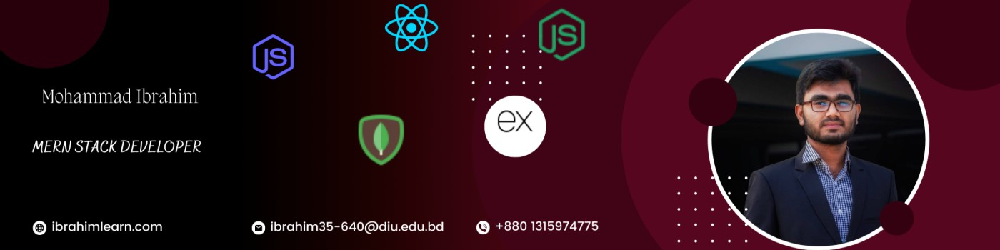

<h1 align="center">
    
</h1>
<h3 align="center">A passionate frontend & Backend developer from Bangladesh</h3>

  

  

- 🔭 I’m currently working on **Islamic App**

- 🌱 I’m currently learning **Next Js ,Spring Boot, Laravel**

- 👯 I’m looking to collaborate on **Multi Vendor Ecommerce**

- 🤝 I’m looking for help with **Dashboard With a Ecommerce Site**

- 💬 Ask me about **React, Node js, Express Js, MongoDB**

- 📫 How to reach me **ibrahim.soft.dev23@gmail.com**

<h3 align="left">Connect with me:</h3>

<h2 align="center">⚒️ Languages-Frameworks-Tools ⚒️</h2>
 

    
     

 

  <h2>🐍 My Contributions 🐍</h2>
   
  
  
     

<h2 align="center">⚡ Stats ⚡</h2>
 

  
  
   
  

 

 
  

&nbsp;

